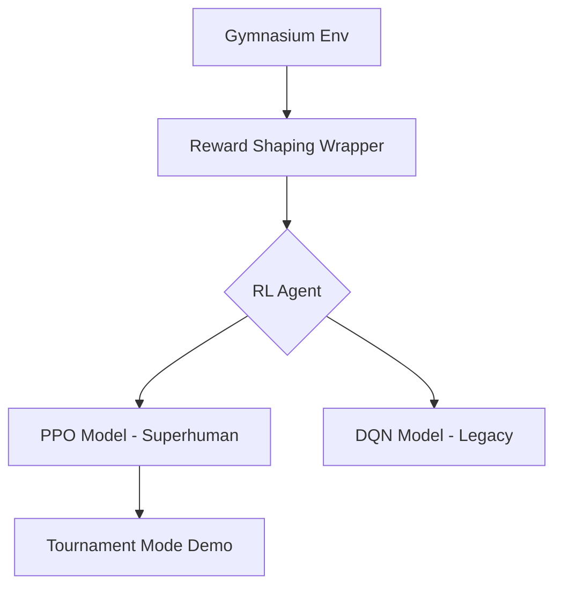

# Flappy-RL: Superhuman AI Agent 🚀

[](https://www.python.org/)
[](https://stable-baselines3.readthedocs.io/)
[](https://opensource.org/licenses/MIT)

An advanced Reinforcement Learning project that trains an autonomous agent to master Flappy Bird using state-of-the-art algorithms (PPO & DQN).

## 🌟 Strategic Features
- **Next-Gen Brain (PPO):** Implemented Proximal Policy Optimization with an MLP policy for stable, high-performance gameplay.
- **Reward Shaping:** Integrated a custom reward wrapper that guides the agent to stay in the center of pipe gaps, accelerating the learning curve.
- **Tournament Mode:** Developed a real-time, side-by-side Pygame interface for Human vs. AI competition.
- **Professional Architecture:** Modular script organization with a clear separation between training, evaluation, and legacy models.

## 🏗️ Project Architecture


## 🚀 Presentation & Usage
### Live Demo (Tournament Mode)
To see the AI compete against a human in real-time:
```bash
python side_by_side.py
```

### Advanced Training
To experiment with the training parameters or retrain the model:
```bash
python scripts/train_ppo.py
```

## ⚙️ Model Benchmarks
| Model | Algorithm | Steps | Peak Score | Status |
| :--- | :--- | :--- | :--- | :--- |
| **V3 (Latest)** | **PPO** | 300k | **80+** | **Mastered** |
| V2 | DQN | 250k | 30 | Stable |
| V1 | DQN | 100k | 6 | Baseline |

---
## 🌐 Deployment
This project is ready to be hosted on **Render** or **Railway** using the provided `Dockerfile`.

### Steps to Host:
1. **GitHub:** Push your code to a GitHub repository.
2. **Platform:** Create a new "Web Service" on [Render](https://render.com).
3. **Connect:** Link your GitHub repo.
4. **Deploy:** Render will detect the `Dockerfile` and start the AI agent automatically.

*Developed by Sarvesh Raam T K | B.Tech AI Student @ SRM University*
